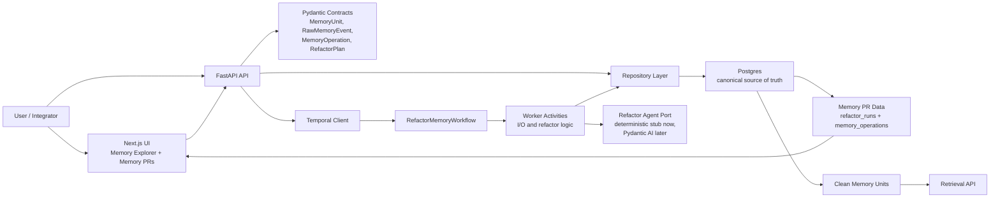
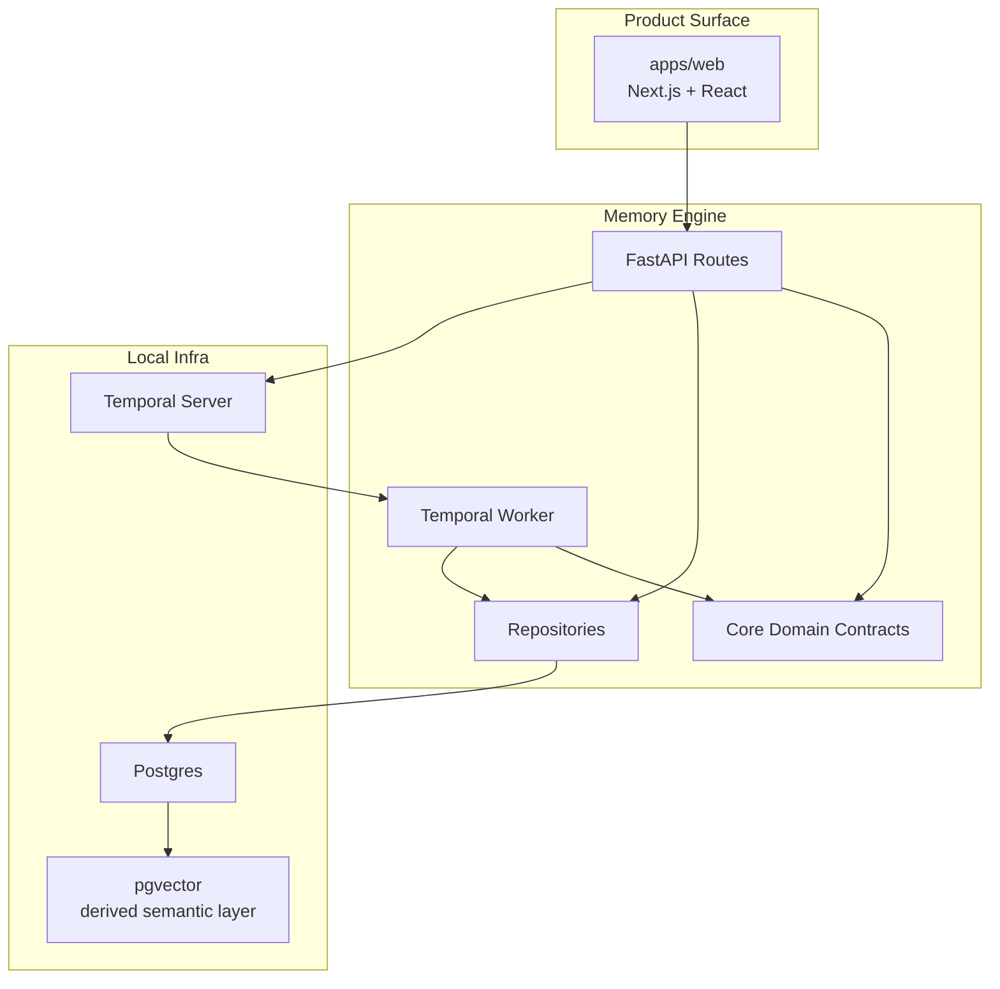
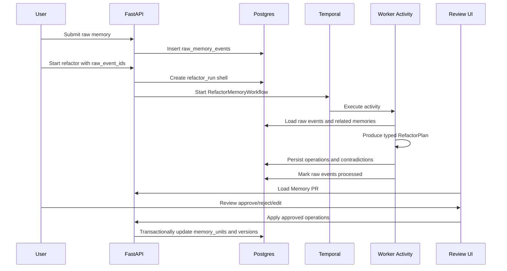

# Architecture

## North Star

The durable primitive is a typed memory operation. Agents should propose operations, not mutate memory directly.

```txt
raw events -> refactor plan -> Memory PR -> approved operations -> clean memory units -> versions
```

This keeps the product closer to a compiler and review system than a summarizer.

## System Map



## Runtime Boundary



Postgres is the source of truth. pgvector starts as a derived semantic retrieval layer inside Postgres. Temporal owns long-running refactor jobs and retries. Workflow code should stay deterministic; I/O belongs in activities.

## Core Product Loop



## Service Map

```txt
apps/web
  Next.js dashboard and review UI
  Memory explorer, Memory PRs, review queue, settings

services/memory-engine
  FastAPI API
  Pydantic contracts
  SQLAlchemy repositories
  Temporal workflows and activities
  AI/refactor agent port

infra
  Postgres
  pgvector extension
  Temporal
  optional future services behind profiles
```

## Data Ownership

Canonical data:

- `raw_memory_events`
- `memory_units`
- `memory_sources`
- `refactor_runs`
- `memory_operations`
- `contradictions`
- `memory_versions`

Implemented derived data:

- embeddings
- relationship edges

Planned canonical or derived data:

- audit logs
- review decisions
- trace metadata
- archive object references

See `docs/data-model.md` for current contract details.

## Future Runtime

The future stack is valid, but it should remain adapter-driven:

```txt
FastAPI
  -> LiteLLM for model routing
  -> Langfuse/OpenTelemetry for traces
  -> R2/S3 for raw archives and snapshots
  -> Qdrant for high-scale semantic retrieval
  -> Graphiti/Neo4j-style graph for temporal relationships
  -> NATS JetStream for event streams
```

Promotion criteria:

- Add LiteLLM when more than one model provider is needed in production.
- Add Langfuse or full OpenTelemetry when model traces and cost analysis drive product decisions.
- Add R2/S3 when raw archives are too large for Postgres rows.
- Add Qdrant when pgvector benchmarks no longer satisfy retrieval needs.
- Add graph storage when Postgres relationship tables cannot model temporal facts cleanly enough.
- Add NATS when multiple services need replayable event streams.

Future systems should be introduced through ports and adapters so the MVP does not depend on them before the memory PR loop is proven.

## Architectural Patterns

- Hexagonal boundaries for future adapters: vector index, model gateway, archive store, event publisher, graph store, tracing.
- Repository pattern for persistence.
- Typed contracts before persistence/UI shape.
- Durable workflow orchestration for long-running refactors.
- Transactional application for approved operations.
- Reviewable operation log before mutation.
- Clean memory retrieval by default, with raw evidence available for audit.

## MVP Status Notes

- Raw event ingestion exists.
- Refactor run persistence exists.
- Temporal workflow start exists.
- Worker activities can produce and persist a plan from raw events.
- Dashboard UI can load API-backed runs, inspect operations and sources, and persist review decisions.
- Approved `create_memory` operations can be applied transactionally with canonical memory and version writes.
- Apply semantics for merge, split, supersede, archive, and contradiction operations remain future product slices.
